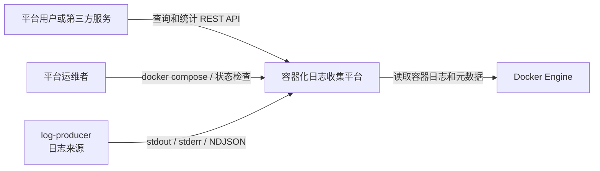
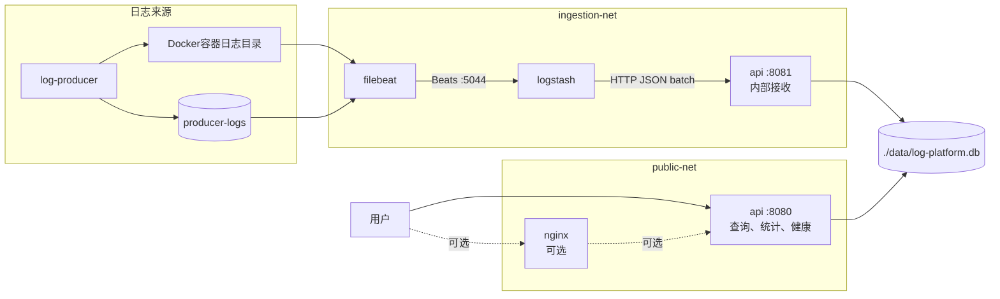
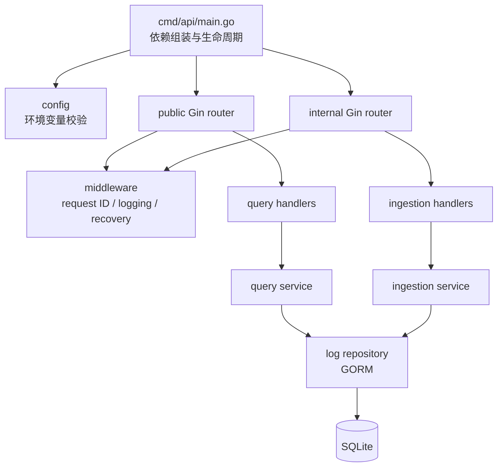
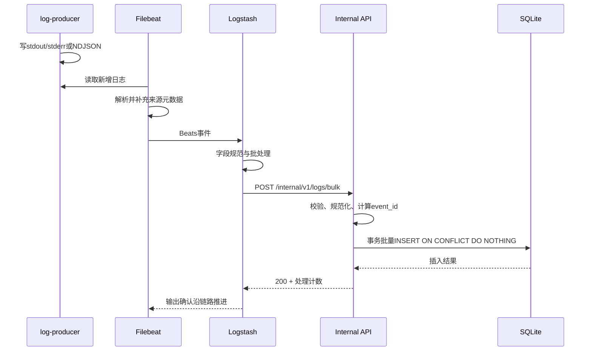

# 容器化日志收集平台架构设计

> 文档编号：CLP-ARCH-001
>
> 文档版本：0.1.0-draft
>
> 目标范围：完整MVP（目标稳定版本v1.0.0）
>
> 增量发布边界见[版本路线图](release-roadmap.md)
>
> 最后更新：2026-07-22
>
> 文档状态：已评审

## 1. 文档目的

本文档把`docs/requirements.md`和三个核心用例转换为可实现的系统架构，明确组件边界、网络、端口、数据流、持久化、故障恢复、安全和性能策略。

本文档描述完整MVP架构。代码级接口和字段细节将在实现过程中由Go类型、API文档和测试进一步固定。

## 2. 架构目标

架构必须同时满足以下目标：

1. Filebeat、Logstash、Gin、GORM和SQLite形成真实端到端链路。
2. stdout、stderr和NDJSON文件日志能够进入同一规范化模型。
3. 暂时性组件故障能够依靠队列、registry和重试恢复。
4. 至少一次传输产生的重复通过幂等键在存储层消除。
5. 公开查询入口与内部日志接收入口隔离。
6. SQLite文件、Filebeat registry和Logstash队列分别持久化。
7. API启动到ready不超过3秒。
8. 10,000条数据和10并发条件下，组合查询p95不超过500ms。
9. 所有组件可以通过Docker Compose一键部署和观察状态。
10. 架构复杂度控制在五天MVP能够完成和解释的范围内。

## 3. 已确认的架构决策

| 决策 | 结论 | 记录位置 |
|---|---|---|
| 日志传输 | Filebeat经Beats协议发送到Logstash，Logstash经HTTP批量发送给Gin | ADR-001 |
| 存储幂等 | 稳定`event_id`加SQLite唯一约束，批量插入使用冲突忽略 | ADR-002 |
| 数据库形态 | SQLite嵌入API进程，数据库文件绑定挂载，不创建SQLite容器 | 本文档 |
| API边界 | 同一Go进程启动公开和内部两个HTTP监听器 | 本文档 |
| 公开入口 | 容器8080端口映射到宿主机 | 本文档 |
| 内部入口 | 容器8081端口仅供Compose内部网络访问，不发布到宿主机 | 本文档 |
| Nginx | MVP核心范围不启用，验收完成后可选 | 本文档 |

## 4. 系统上下文



平台外部只有两类接口：

- 面向用户的公开查询接口。
- 面向Docker Engine的只读日志和元数据访问。

日志接收接口属于平台内部接口，不是公共产品API。

## 5. 容器视图



### 5.1 服务职责

| 服务 | 单一主要职责 | 明确不负责 |
|---|---|---|
| `log-producer` | 生成可编号、可重复验证的三类日志 | 不直接写SQLite，不调用内部接收API |
| `filebeat` | 发现、读取、解析日志并补充来源元数据 | 不做业务查询，不直接写SQLite |
| `logstash` | 接收Beats事件、规范字段并批量调用内部API | 不保存最终业务数据，不提供用户查询 |
| `api` | 校验、幂等存储、查询、统计和健康管理 | 不主动读取Docker日志文件 |
| `nginx` | 可选反向代理 | 不进入MVP核心验收 |

### 5.2 SQLite说明

SQLite不是Compose服务。它由API进程通过GORM访问，文件位于：

```text
/app/data/log-platform.db
```

宿主机对应：

```text
./data/log-platform.db
```

## 6. 网络与端口设计

### 6.1 网络

| 网络 | 连接服务 | 作用 |
|---|---|---|
| `ingestion-net` | `filebeat`、`logstash`、`api` | Beats和内部HTTP日志传输 |
| `public-net` | `api`、可选`nginx` | 公开查询和健康入口 |

`log-producer`不需要访问其他业务服务。若实现允许，优先使用`network_mode: none`；否则放入不连接API的独立来源网络。

### 6.2 端口

| 服务 | 容器端口 | 是否发布到宿主机 | 用途 |
|---|---:|---:|---|
| `api` | 8080 | 是 | `/api/v1/*`、`/healthz`、`/readyz` |
| `api` | 8081 | 否 | `/internal/v1/logs`、`/internal/v1/logs/bulk` |
| `logstash` | 5044 | 否 | Filebeat Beats输入 |

建议公开映射：

```text
${API_PORT:-8080}:8080
```

宿主机不能直接访问8081和5044。`EXPOSE`仅表示镜像元数据，不作为安全控制，真正边界由Compose端口发布和网络配置实现。

### 6.3 双HTTP监听器

API进程启动两个独立的`http.Server`：

- Public Server：监听`:8080`，只注册公开路由。
- Internal Server：监听`:8081`，只注册日志接收路由。

两个Server共享配置、logger、service和repository，但使用不同Gin Engine，防止仅靠路径约定混合内部和公开入口。

## 7. API进程内部结构



### 7.1 包职责

| 包 | 职责 |
|---|---|
| `cmd/api` | 创建依赖、启动双HTTP Server、处理信号和优雅停机 |
| `internal/config` | 从环境变量读取配置、默认值和启动前校验 |
| `internal/server` | 创建公开和内部Router，管理HTTP生命周期 |
| `internal/middleware` | request ID、结构化请求日志、Recovery和统一上下文 |
| `internal/handler` | HTTP解析、调用Service、映射状态码和响应DTO |
| `internal/ingestion` | 事件规范化、永久错误分类和幂等键计算 |
| `internal/service` | 查询、统计和批量接收业务规则 |
| `internal/repository` | GORM查询、事务、迁移和SQLite错误映射 |
| `internal/model` | 数据库模型和输入输出DTO所需的领域结构 |

### 7.2 依赖方向

```text
handler
→ service / ingestion
→ repository接口
→ GORM repository实现
→ SQLite
```

下层包不依赖Gin。HTTP类型不得进入repository；GORM模型不得直接作为所有公开响应，避免数据库结构与API永久绑定。

## 8. 公开API设计

Public Server注册：

```text
GET /healthz
GET /readyz
GET /api/v1/logs
GET /api/v1/logs/:id
GET /api/v1/stats/levels
GET /api/v1/stats/services
```

公开中间件顺序：

```text
request ID
→ structured request logger
→ recovery
→ handler
```

查询流程：

1. Handler解析路径和查询参数。
2. Service验证组合规则并构造领域查询条件。
3. Repository使用GORM参数化查询和固定排序。
4. Handler返回统一响应和request ID。

## 9. 内部接收API设计

Internal Server注册：

```text
POST /internal/v1/logs
POST /internal/v1/logs/bulk
```

Logstash主要使用批量入口。批量请求体采用JSON数组：

```json
[
  {
    "source_event_id": "producer-event-0001",
    "container_name": "container-log-producer-1",
    "container_id": "example-container-id",
    "service": "log-producer",
    "level": "INFO",
    "message": "example log message",
    "source": "stdout",
    "logged_at": "2026-07-22T08:00:00Z"
  }
]
```

`source_event_id`是来源服务提供的可选标识；数据库中的平台`event_id`始终由API按照ADR-002计算，不能直接信任客户端把某个字符串当作全局唯一键。

批量响应：

```json
{
  "data": {
    "received": 100,
    "inserted": 98,
    "duplicated": 2,
    "rejected": 0
  },
  "request_id": "example-request-id"
}
```

### 9.1 状态码与重试语义

| 结果 | 状态码 | Logstash行为 |
|---|---:|---|
| 批次完成，允许含重复或已分类的永久拒绝项 | 200 | 确认，不重试整个批次 |
| 请求JSON整体无法解析 | 400 | 永久错误，记录并停止重试该请求 |
| 请求整体超过上限 | 413 | 永久错误，记录并停止重试该请求 |
| 限流或暂时过载 | 429 | 重试 |
| SQLite暂时不可用或服务未就绪 | 503 | 重试 |
| 未预期内部错误 | 500 | 重试，同时根据request ID排查 |

单条永久无效事件在200响应的`rejected`计数和API错误日志中体现，防止一个坏事件导致整个批次无限重试。

## 10. 日志采集与传输时序



传输细节见ADR-001，幂等策略见ADR-002。

## 11. Filebeat设计

### 11.1 输入

配置两个逻辑输入：

1. Docker容器日志输入：读取目标容器stdout/stderr对应的Docker日志文件，并解析容器日志封装。
2. NDJSON文件输入：读取`producer-logs`中的`*.ndjson`。

每个filestream输入使用稳定、唯一且不随容器重启变化的`id`。

### 11.2 采集范围

- 通过Compose label或明确容器匹配规则只包含`log-producer`。
- 显式排除Filebeat、Logstash和API。
- Filebeat自身运行日志不进入同一Filebeat输出链路。

### 11.3 元数据

事件统一补充或映射：

```text
container.name
container.id
service.name
log.file.path
log.offset
stream
source
source_event_id（来源存在时）
```

Logstash负责把ECS风格字段映射为内部API字段。

### 11.4 状态与缓冲

- Filebeat data目录使用`filebeat-data`命名卷。
- registry在容器重建后保留。
- 启用有明确上限的磁盘队列，初始容量在部署配置中固定并写入文档。
- 只在下游确认后推进已发布事件状态。

## 12. Logstash设计

### 12.1 输入

- Beats input监听容器端口5044。
- 只连接`ingestion-net`，不向宿主机发布端口。

### 12.2 过滤与映射

Logstash只执行传输所需的轻量转换：

- 映射容器和服务字段。
- 统一`source`字段。
- 保留来源时间和必要的Filebeat元数据。
- 删除不需要发送给API的巨大或无关元数据。
- 不承担最终业务去重和SQLite模型规则。

### 12.3 输出

- HTTP output发送到`http://api:8081/internal/v1/logs/bulk`。
- 使用JSON批次格式和`application/json`。
- 对429和5xx执行重试。
- 因POST接口具有幂等存储效果，允许对网络失败后的不确定请求重试。

### 12.4 持久队列

- 启用Logstash persistent queue。
- data目录挂载`logstash-data`命名卷。
- 队列最大容量必须显式配置，避免无限占用磁盘。
- 队列积压量和投递错误通过Logstash运行日志观察。

## 13. 数据存储设计

### 13.1 数据模型

`logs`表字段遵循需求文档：

```text
id
event_id
source_event_id
container_name
container_id
service
level
message
source
log_path
log_offset
logged_at
ingested_at
raw_event
```

### 13.2 索引

```text
UNIQUE(event_id)
INDEX(container_name, level, logged_at, id)
INDEX(service, logged_at, id)
INDEX(logged_at, id)
```

最终索引名称由GORM迁移固定，并通过SQLite查询计划和性能测试验证。

### 13.3 SQLite运行参数

MVP初始策略：

- 启用WAL模式，允许读请求与单写入路径更好地并行。
- 设置合理的busy timeout，暂时锁竞争不立即失败。
- 启用外键约束，即使首版只有单表也保持一致基线。
- 初始限制较小的数据库连接池，优先保证SQLite写入行为可预测。
- 批量入库使用短事务，不在事务中执行网络操作。

具体DSN参数和连接数在实现时通过集成与性能测试确定，不以未经验证的默认值作为最终结论。

### 13.4 迁移

- API启动时执行可重复的GORM迁移。
- 迁移完成且SQLite可读写后，`/readyz`才返回成功。
- 同一版本重复启动不得删除数据或重复创建冲突索引。
- 后续复杂迁移再引入显式迁移版本工具，MVP不提前增加额外系统。

## 14. 持久化与挂载

| 名称 | 类型 | 容器路径 | 读写方 | 作用 |
|---|---|---|---|---|
| `./data` | bind | `/app/data` | API读写 | SQLite文件 |
| `producer-logs` | named volume | 生产者和Filebeat各自约定路径 | 生产者写、Filebeat只读 | NDJSON来源 |
| `filebeat-data` | named volume | `/usr/share/filebeat/data` | Filebeat读写 | registry和磁盘队列 |
| `logstash-data` | named volume | `/usr/share/logstash/data` | Logstash读写 | 持久队列和状态 |
| Docker日志目录 | read-only bind | Docker实际容器日志路径 | Filebeat只读 | stdout/stderr来源 |
| Docker socket | read-only bind | `/var/run/docker.sock` | Filebeat只读使用 | 容器元数据 |

`docker compose down`保留命名卷和bind数据；`docker compose down -v`是显式破坏性操作，不写入普通停止流程。

## 15. 配置管理

API配置从环境变量读取，至少包括：

```text
APP_ENV
PUBLIC_ADDR
INTERNAL_ADDR
DATABASE_PATH
LOG_LEVEL
SHUTDOWN_TIMEOUT
MAX_LOG_MESSAGE_BYTES
DEFAULT_PAGE_SIZE
MAX_PAGE_SIZE
```

规则：

- 提供`.env.example`，不提交实际`.env`。
- 必要配置缺失或非法时快速失败，并给出不含密钥的错误。
- 默认值只用于本地开发，不隐藏关键生产行为。
- Filebeat和Logstash配置作为版本化文件进入仓库。

## 16. 启动、就绪与优雅停机

### 16.1 API启动

```text
读取配置
→ 创建结构化logger
→ 打开SQLite
→ 设置SQLite参数
→ 执行迁移
→ 创建repository和service
→ 启动public server
→ 启动internal server
→ 标记ready
```

启动到ready目标不超过3秒，不等待Filebeat或Logstash连接成功。

### 16.2 API停机

收到`SIGINT`或`SIGTERM`后：

1. 将ready状态设为false。
2. 同时停止公开和内部Server接收新请求。
3. 在`SHUTDOWN_TIMEOUT`内等待正在处理的请求完成。
4. 关闭SQLite连接。
5. 刷新必要日志并退出。

### 16.3 其他组件

- Logstash和Filebeat依靠自身重试保证启动顺序不是正确性的必要条件。
- Compose健康检查和`depends_on`用于减少无意义的启动错误，不替代运行期恢复。
- `log-producer`可以等待采集链路健康后再开始，也允许链路稍晚恢复后补采已落盘日志。

## 17. 故障恢复矩阵

| 故障 | 直接表现 | 暂存位置 | 恢复方式 | 去重位置 |
|---|---|---|---|---|
| Logstash不可用 | Filebeat输出失败 | Filebeat磁盘队列和来源文件 | Filebeat重连 | API/SQLite |
| API不可用 | Logstash HTTP失败 | Logstash持久队列 | HTTP重试 | API/SQLite |
| SQLite暂时锁定 | API返回暂时错误 | Logstash持久队列 | busy timeout后重试 | API/SQLite |
| API重启 | 短时503或连接失败 | Logstash持久队列 | API恢复ready | API/SQLite |
| Filebeat重启 | 暂停读取 | 来源文件、registry、磁盘队列 | 从registry续读 | API/SQLite |
| 来源容器重启 | 容器ID变化 | Docker日志和文件卷 | Filebeat发现新来源 | API/SQLite |
| 单条永久非法事件 | 批次出现rejected | API错误摘要 | 不重试该事件 | 不入库 |

所有容量都有上限。超过Filebeat磁盘队列、Logstash持久队列、Docker日志保留和宿主机磁盘的组合容量后，系统不能承诺无限期无丢失；部署文档必须说明验收所使用的容量和故障时间范围。

## 18. 安全设计

### 18.1 最小暴露

- 只发布公开API端口。
- Logstash 5044和API 8081不映射到宿主机。
- Nginx未启用时用户直接访问API 8080。

### 18.2 进程权限

- API最终镜像使用非root用户。
- SQLite目录在镜像和挂载初始化时赋予正确UID/GID权限。
- Filebeat因Docker日志和元数据采集可能需要较高容器权限，该风险必须记录，挂载保持只读。

### 18.3 输入保护

- 限制请求体和单条message大小。
- GORM查询只使用参数化条件。
- 不接受客户端提供任意SQL、列名或排序表达式。
- 错误响应不暴露SQL、堆栈、数据库路径和内部网络信息。
- 运行日志不完整记录用户正文、Cookie、Authorization等敏感Header。

### 18.4 密钥与配置

- `.env`和未来证书不进入Git。
- MVP内部网络不引入复杂认证，但架构保留后续内部令牌或mTLS扩展点。

## 19. 性能设计

### 19.1 查询

- 过滤和统计在SQLite中执行，不把全表读入Go内存。
- 使用与验收查询匹配的组合索引。
- 固定允许的排序方式。
- 默认分页20，最大100。
- 列表响应不默认返回体积较大的`raw_event`。

### 19.2 写入

- Logstash批量调用内部API，减少每条事件HTTP开销。
- API短事务批量写入。
- 使用唯一索引和冲突忽略完成幂等，不先逐条查询再逐条插入。
- 批次大小在端到端测试中调优，不能大到导致413或长事务。

### 19.3 启动

- 迁移保持轻量和可重复。
- API就绪不依赖Filebeat和Logstash完成连接。
- 配置解析和数据库初始化失败时快速退出，不长时间假装启动中。

## 20. 可观测性设计

API使用Go结构化JSON日志，至少定义：

```text
service_start
service_ready
service_shutdown
http_request
log_batch_received
log_batch_persisted
log_batch_failed
database_error
```

公共字段：

```text
time
level
msg
event
service
request_id
```

请求日志附加method、path、status和latency_ms。批量接收日志只记录计数和事件标识摘要，不完整打印日志正文。

Filebeat和Logstash使用各自运行日志观察输入启动、连接、队列积压和重试。MVP不引入Prometheus，但不得阻碍后续增加指标端点。

## 21. 测试架构

| 层次 | 范围 | 依赖 |
|---|---|---|
| 单元测试 | 配置、参数、规范化、幂等算法、Service规则 | 无外部服务 |
| Handler测试 | 状态码、JSON、Header、request ID | `httptest`和mock Service |
| Repository集成测试 | 迁移、索引、事务、组合查询、统计 | 临时SQLite文件 |
| API集成测试 | Internal/Public路由和真实Repository | 临时SQLite文件 |
| Compose E2E | Filebeat到SQLite完整链路 | 完整Compose平台 |
| 故障注入 | API、Logstash、Filebeat重启 | 完整Compose平台 |
| 性能测试 | 10,000条、10并发、30秒 | 启动后的API和预置SQLite |

核心Go包覆盖率目标不低于80%，但覆盖率不能替代故障场景和端到端验证。

## 22. 代码目录映射

```text
container-log-platform/
├── cmd/api/
├── internal/
│   ├── config/
│   ├── handler/
│   ├── ingestion/
│   ├── middleware/
│   ├── model/
│   ├── repository/
│   ├── server/
│   └── service/
├── deployments/
│   ├── filebeat/
│   └── logstash/pipeline/
├── test/
│   ├── e2e/
│   └── performance/
├── docs/
│   ├── adr/
│   └── use-cases/
├── data/
├── compose.yaml
├── Dockerfile
├── .dockerignore
├── .env.example
├── README.md
└── CHANGELOG.md
```

目录在首次实现中按真实职责创建，不预先提交大量空包。

## 23. 架构验收检查

实现完成后必须逐项确认：

- [ ] API、Filebeat、Logstash和`log-producer`职责与本文档一致。
- [ ] SQLite不是独立容器，数据库文件位于宿主机`./data`。
- [ ] 8081和5044没有发布到宿主机。
- [ ] Filebeat只采集允许的来源，没有递归采集。
- [ ] Logstash使用持久队列和HTTP批量输出。
- [ ] API使用唯一`event_id`实现幂等存储。
- [ ] Public和Internal Router分离。
- [ ] 三类来源均通过端到端测试。
- [ ] 故障恢复矩阵中的核心场景有自动或可重复测试。
- [ ] 启动和查询性能达到需求指标。
- [ ] 所有持久化挂载通过容器重建测试。

## 24. 后续演进方向

不属于MVP，但架构保留以下演进方向：

- Nginx或API Gateway统一公开入口。
- 内部API令牌、mTLS或网络策略。
- SQLite迁移到服务型数据库或Elasticsearch。
- Logstash替换为Kafka传输链路。
- Prometheus指标和Grafana面板。
- Kubernetes部署和Filebeat DaemonSet。
- 日志脱敏、租户隔离和保留策略。

演进不得在当前MVP尚未验收前提前引入。
