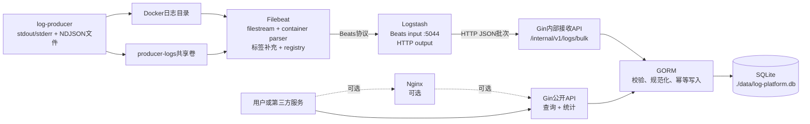

# 项目二：容器化日志收集平台实施方案

> 文档状态：已确认的实施基线  
> 制定日期：2026-07-22  
> 目标版本：v0.1.0  
> 工作方式：Git Flow + Conventional Commits + 文档驱动开发

## 1. 项目目标

基于 Go、Gin、GORM、SQLite、Docker Compose、Filebeat 和 Logstash，实现一个轻量级容器日志收集平台，打通以下完整链路：

```text
容器产生日志
→ Filebeat采集、解析和分类
→ Logstash接收并转发
→ Gin内部接收接口
→ GORM写入SQLite
→ REST API组合查询和统计
```

项目必须做到采集、传输、存储、查询、统计和部署相互连通，不能把“Filebeat打印日志”和“手动调用API写数据库”作为两套互不相连的演示。

## 2. 已确认的架构决策

### 2.1 Compose服务

MVP中的服务包括：

| 服务 | 是否必需 | 职责 |
|---|---:|---|
| `api` | 是 | 接收日志、校验和去重、写入SQLite、提供查询与统计API |
| `filebeat` | 是 | 采集目标容器的stdout/stderr和共享目录中的NDJSON日志 |
| `log-producer` | 是 | 生成可预测、可验证的示例日志，供端到端测试使用 |
| `logstash` | 是 | 接收Filebeat的Beats事件并通过HTTP发送给Gin内部接口 |
| `nginx` | 否 | 反向代理；核心功能验收通过后再决定是否加入 |

SQLite不是独立服务。它作为嵌入式数据库运行在`api`进程中，数据库文件通过绑定挂载保存在仓库的`./data`目录。

### 2.2 日志传输方案

采用以下传输链路：

```text
Filebeat output.logstash
→ Logstash beats input
→ Logstash http output
→ POST /internal/v1/logs/bulk
→ Gin + GORM + SQLite
```

选择Logstash的原因：Filebeat没有面向任意业务接口的通用HTTP输出，而Logstash可以标准接收Beats协议，并将事件发送到通用HTTP端点。

### 2.3 数据持久化方案

- SQLite数据库：绑定挂载`./data:/app/data`。
- Filebeat registry：命名卷`filebeat-data`。
- Logstash持久队列：命名卷`logstash-data`。
- `log-producer`文件日志：共享卷`producer-logs`，Filebeat只读挂载。
- 不创建所谓的“SQLite容器”。

### 2.4 交付边界

MVP必做：

- stdout/stderr日志采集。
- NDJSON文件日志采集。
- 按容器、服务和级别分类。
- SQLite持久化。
- 条件组合查询。
- 日志统计。
- 故障恢复与幂等去重。
- Docker Compose一键部署。
- 单元、集成、端到端和性能测试。
- 完整工程文档。

MVP暂不包含：

- Web管理界面。
- Elasticsearch、Kibana或Grafana。
- Kafka、Redis或Kubernetes。
- 用户系统、RBAC和多租户。
- 全文搜索和复杂告警。
- Nginx；它作为时间允许时的增强项。

## 3. 总体架构



## 4. 端到端数据流程

### 4.1 正常采集

1. `log-producer`输出结构化日志到stdout/stderr，同时向共享目录写入NDJSON文件。
2. Filebeat只监听指定容器和指定目录，避免采集自身日志形成循环。
3. Filebeat解析每条事件并补充`container_name`、`container_id`、`service`、`source`等字段。
4. Filebeat通过Beats协议把事件发送给Logstash的5044端口。
5. Logstash规范化字段，以JSON批次调用Gin内部接收接口。
6. Gin校验事件，并按ADR-002计算平台`event_id`，通过GORM执行幂等写入。
7. SQLite唯一索引拒绝重复事件。
8. 用户通过公开REST API查询和统计日志。

### 4.2 故障恢复

- API暂时不可用时，Logstash保留尚未确认的事件并重试。
- Logstash启用持久队列，避免容器重启后内存队列丢失。
- Logstash不可用时，Filebeat保留读取状态并重试发送。
- Filebeat registry持久化，容器重建后继续从已记录位置读取。
- 传输体系按“至少一次”设计，因此最终由`event_id`唯一约束保证SQLite不重复。
- 故障恢复测试只承诺在明确的测试条件和缓冲容量范围内无丢失，不做无法验证的无限场景承诺。

## 5. 数据模型

### 5.1 logs表

| 字段 | 类型建议 | 约束 | 说明 |
|---|---|---|---|
| `id` | INTEGER | 主键、自增 | 数据库内部ID |
| `event_id` | TEXT | 非空、唯一 | 幂等键 |
| `source_event_id` | TEXT | 可空 | 来源事件标识，仅作为平台指纹输入 |
| `container_name` | TEXT | 非空 | 来源容器名 |
| `container_id` | TEXT | 可空 | Docker容器ID |
| `service` | TEXT | 非空 | 逻辑服务名 |
| `level` | TEXT | 非空 | DEBUG、INFO、WARN、ERROR等 |
| `message` | TEXT | 非空 | 日志正文 |
| `source` | TEXT | 非空 | `stdout`、`stderr`或`file` |
| `log_path` | TEXT | 可空 | 文件日志路径 |
| `log_offset` | INTEGER | 可空 | Filebeat读取偏移量 |
| `logged_at` | DATETIME | 非空 | 日志发生时间，统一存UTC |
| `ingested_at` | DATETIME | 非空 | 平台入库时间，统一存UTC |
| `raw_event` | TEXT | 可空 | 原始事件JSON，便于排查 |

建议索引：

```text
UNIQUE(event_id)
INDEX(container_name, level, logged_at)
INDEX(service, logged_at)
INDEX(logged_at)
```

### 5.2 event_id策略

数据库中的`event_id`始终由API按照ADR-002计算，不能直接信任来源字符串作为全局唯一键。最终格式为`v1:<SHA-256摘要>`。

来源提供稳定`source_event_id`时，平台使用`service + source_event_id`作为规范指纹输入。来源没有该字段时，使用固定结构中的稳定来源信息计算摘要，包括：

```text
agent_id
container_id
source
log_path
log_offset
logged_at
message
```

字段规范化方式、顺序和编码以ADR-002为准，并通过“相同来源事件重复提交只保存一次”的集成测试固定算法行为。

## 6. API设计基线

### 6.1 内部日志接收接口

```http
POST /internal/v1/logs
POST /internal/v1/logs/bulk
```

要求：

- 接收单条或批量JSON事件。
- 校验必要字段和时间格式。
- 支持幂等写入。
- 批量接口使用事务。
- 返回接收数、插入数、重复数和拒绝数。
- 只在Compose内部网络暴露，不直接映射到宿主机。

批量响应示例：

```json
{
  "data": {
    "received": 100,
    "inserted": 98,
    "duplicated": 2,
    "rejected": 0
  },
  "request_id": "example-request-id"
}
```

### 6.2 公开查询接口

```http
GET /api/v1/logs
GET /api/v1/logs/:id
```

`GET /api/v1/logs`支持：

```text
container
service
level
start
end
page
page_size
```

规则：

- 所有过滤条件都可选并支持组合。
- 默认按`logged_at`倒序。
- 时间参数使用RFC3339。
- `start`不得晚于`end`。
- `page`默认1。
- `page_size`默认20，最大100。
- 无匹配数据返回HTTP 200和空数组。

### 6.3 统计接口

```http
GET /api/v1/stats/levels
GET /api/v1/stats/services
```

要求：

- 支持时间范围过滤。
- 支持按容器或服务进一步筛选。
- 返回数量和占比。
- 空数据返回可预测的空结果。

### 6.4 健康检查

```http
GET /healthz
GET /readyz
```

- `/healthz`表示进程存活。
- `/readyz`表示配置正确且SQLite可访问。

### 6.5 统一错误响应

```json
{
  "error": {
    "code": "INVALID_ARGUMENT",
    "message": "start must not be later than end"
  },
  "request_id": "example-request-id"
}
```

## 7. 功能验收标准

### 7.1 UC-001：容器日志采集与分类

- 能采集`log-producer`的stdout日志。
- 能采集`log-producer`的stderr日志。
- 能采集共享目录中的NDJSON文件日志。
- 入库事件包含正确的容器名、服务名、级别、时间和来源。
- Filebeat不会采集自己的输出形成递归日志。
- 重启`log-producer`后能自动继续采集。
- 重启Filebeat后不会把已确认事件重复写入SQLite。

### 7.2 UC-002：日志条件查询和统计

- 容器名、级别、开始时间和结束时间的组合查询结果正确。
- 服务名过滤正确。
- 结果默认按时间倒序。
- 参数无效时返回HTTP 400和具体错误原因。
- ID不存在时返回HTTP 404。
- 无匹配列表数据时返回HTTP 200和`data: []`。
- 统计数量与数据库实际数据一致。

### 7.3 UC-003：一键部署

在新环境中执行：

```bash
docker compose up -d --build
```

应达到：

- 所有必需服务最终健康。
- API可访问。
- Filebeat到Logstash网络正常。
- Logstash到API内部网络正常。
- 无需在容器内手工执行初始化命令。
- Go服务重启后自动恢复。
- Compose重建后SQLite数据仍存在。

## 8. 量化验收标准

### 8.1 启动时间

- 从`api`容器开始运行到`/readyz`首次成功不超过3秒。
- 不包含首次镜像拉取和镜像构建时间。
- 连续测试至少5次，并在报告中记录结果。

### 8.2 查询性能

测试基线：

- SQLite预置10,000条日志。
- 10个并发客户端。
- 持续30秒。
- 使用容器名、级别和时间范围组合查询。
- p95响应时间不超过500ms。
- 报告中记录硬件、WSL版本、Docker版本、数据量、并发量和测试命令。

### 8.3 无丢失与去重

标准故障注入流程：

1. 生成1000条具有唯一`source_event_id`的日志。
2. 等待端到端采集完成。
3. 验证数据库总数和唯一数均为1000。
4. 停止API或Logstash。
5. 再生成200条日志。
6. 恢复服务并等待重试完成。
7. 验证总数和唯一数均为1200。
8. 重启Filebeat后再次验证数量仍为1200。

通过条件：在约定缓冲容量和等待时间内，缺失数为0，重复存储数为0。

### 8.4 测试质量

- `go test ./...`全部通过。
- 核心包测试覆盖率目标不低于80%。
- repository、service、handler和ingestion均有测试。
- 至少包含一个Compose端到端测试脚本。
- 所有验收命令和结果进入测试报告。

## 9. Docker与Compose设计约束

### 9.1 API镜像

- 使用多阶段构建。
- 固定Go和基础镜像版本。
- 最终容器使用非root用户。
- 使用`.dockerignore`排除源码无关内容。
- 只复制运行所需文件。
- 支持`SIGTERM`优雅停机。
- 不把配置、代理地址或密钥写死进镜像。

### 9.2 网络

建议拆分：

| 网络 | 可访问服务 | 目的 |
|---|---|---|
| `ingestion-net` | filebeat、logstash、api | 日志采集和传输 |
| `public-net` | api、可选nginx | 对外查询入口 |

内部日志接收接口只通过`ingestion-net`访问。

### 9.3 挂载

| 挂载 | 类型 | 使用者 | 用途 |
|---|---|---|---|
| `./data:/app/data` | bind mount | api | SQLite文件持久化并便于验收查看 |
| `producer-logs` | named volume | log-producer、filebeat | 文件日志共享 |
| `filebeat-data` | named volume | filebeat | registry持久化 |
| `logstash-data` | named volume | logstash | 持久队列 |
| Docker日志目录 | read-only bind | filebeat | stdout/stderr采集 |
| Docker socket | read-only bind | filebeat | 获取容器元数据；需记录安全风险 |

### 9.4 版本

所有容器镜像必须使用明确版本，禁止使用`latest`。最终版本在首次兼容性验证后锁定，并记录在部署文档中。

## 10. Go项目结构

```text
container-log-platform/
├── cmd/
│   └── api/
│       └── main.go
├── internal/
│   ├── config/
│   ├── handler/
│   ├── ingestion/
│   ├── middleware/
│   ├── model/
│   ├── repository/
│   ├── service/
│   └── server/
├── deployments/
│   ├── filebeat/
│   │   └── filebeat.yml
│   └── logstash/
│       └── pipeline/
│           └── logstash.conf
├── test/
│   ├── e2e/
│   └── performance/
├── docs/
│   ├── adr/
│   └── use-cases/
├── data/
│   └── .gitkeep
├── compose.yaml
├── Dockerfile
├── .dockerignore
├── .gitignore
├── go.mod
├── go.sum
├── README.md
└── CHANGELOG.md
```

结构原则：

- `cmd/api`只负责组装依赖和启动服务。
- Handler只处理HTTP输入输出。
- Service承载业务规则。
- Repository封装GORM和SQLite访问。
- Ingestion处理外部日志事件的规范化和幂等逻辑。
- 不为了“分层”创建没有职责的空包。

## 11. 中间件与运行日志

必须包含：

- request ID中间件。
- 结构化JSON请求日志。
- Gin Recovery。
- 统一错误响应。
- 请求耗时和状态码。
- 错误日志中的request ID。

要求：

- 不记录密钥等敏感Header。
- 默认不完整记录用户提交的原始日志正文，避免二次泄露。
- `/healthz`可减少访问日志噪声。
- Filebeat必须过滤自身与Logstash的运行日志，除非有明确采集目的。

## 12. 测试策略

### 12.1 单元测试

- 参数校验。
- 时间范围解析。
- 级别规范化。
- `event_id`计算。
- Service业务逻辑。
- Repository查询构造。

### 12.2 Handler测试

- 使用`httptest`验证状态码、Header和JSON结构。
- 覆盖正常、空数据、非法参数和内部错误。
- 验证request ID在响应和日志链路中存在。

### 12.3 集成测试

- 使用临时SQLite数据库。
- 验证GORM迁移和索引。
- 验证批量写入事务。
- 验证重复事件幂等。
- 验证组合查询和统计。

### 12.4 端到端测试

- Compose从空环境启动。
- `log-producer`生成可编号事件。
- 轮询API直到预期事件入库。
- 验证字段、数量、查询和统计。
- 注入API、Logstash和Filebeat重启故障。

### 12.5 性能测试

- 查询性能与写入吞吐分开测量。
- 使用固定随机种子生成测试数据。
- 报告p50、p95、p99和错误率。
- 结果不只保留截图，还保存命令和原始摘要。

## 13. 任务清单

| ID | 任务 | 主要产物 | 完成条件 |
|---|---|---|---|
| P2-01 | 需求基线 | requirements、3个用例 | 范围和指标无歧义 |
| P2-02 | 架构设计 | 架构图、时序图、ADR | 数据链路和故障策略明确 |
| P2-03 | 项目骨架 | Go模块、目录、基础CI | `go test ./...`可执行 |
| P2-04 | 数据层 | GORM模型、迁移、索引 | 持久化和幂等测试通过 |
| P2-05 | 内部接收API | 单条和批量接口 | 校验、事务、去重通过 |
| P2-06 | 查询API | 条件查询、详情、分页 | 组合查询行为正确 |
| P2-07 | 统计API | 级别和服务统计 | 数量、占比和过滤正确 |
| P2-08 | 日志生产器 | stdout、stderr、文件输出 | 可生成确定数量和ID的事件 |
| P2-09 | Filebeat | 两类输入、标签、registry | 采集和恢复测试通过 |
| P2-10 | Logstash | Beats输入、HTTP批量输出 | 能可靠投递给内部API |
| P2-11 | Compose | 网络、挂载、健康检查 | 一条命令完成部署 |
| P2-12 | 质量验证 | 单测、集成、E2E、性能 | 所有量化指标通过 |
| P2-13 | 发布交付 | 全套文档、CHANGELOG | release流程和v0.1.0完成 |

依赖顺序：

```text
P2-01
→ P2-02
→ P2-03
→ P2-04
→ P2-05
→ P2-06 / P2-07
→ P2-08 / P2-09 / P2-10
→ P2-11
→ P2-12
→ P2-13
```

## 14. Git Flow工作流

### 14.1 长期分支

- `main`：仅保存可发布版本。
- `develop`：集成已完成并通过测试的功能。

### 14.2 临时分支

- `feature/*`：从`develop`创建，完成后合并回`develop`。
- `release/*`：从`develop`创建，完成发布修复后合并到`main`和`develop`。
- `hotfix/*`：从`main`创建，修复后合并到`main`和`develop`。

计划中的功能分支：

```text
feature/requirements-and-architecture
feature/project-bootstrap
feature/log-storage
feature/log-ingestion
feature/query-api
feature/statistics-api
feature/observability
feature/integration-tests
```

发布流程：

```text
develop
→ release/v0.1.0
→ main
→ tag v0.1.0
→ 合并回develop
```

### 14.3 分支规则

- 不直接向`main`和`develop`提交功能代码。
- 功能分支保持单一目标。
- 合并前必须通过格式化、静态检查和测试。
- 在GitHub上通过Pull Request合并。
- `main`和`develop`启用分支保护和必需检查。
- 发布标签使用语义化版本。

### 14.4 提交规范

使用Conventional Commits：

```text
docs: define requirements and acceptance criteria
feat(storage): add log model and SQLite migration
feat(api): implement combined log query
feat(ingestion): add idempotent batch ingestion
test(ingestion): verify restart recovery and deduplication
chore(docker): add compose health checks
fix(api): reject invalid time ranges
refactor(repository): isolate log query construction
```

一次提交只表达一个清晰意图，不提交数据库文件、构建产物、日志、密钥或IDE临时文件。

## 15. 文档交付物

最终仓库至少包含：

```text
README.md
docs/requirements.md
docs/architecture.md
docs/use-cases/UC-001-log-ingestion.md
docs/use-cases/UC-002-log-query.md
docs/use-cases/UC-003-compose-deployment.md
docs/adr/ADR-001-log-transport.md
docs/adr/ADR-002-idempotency.md
docs/api.md 或 openapi.yaml
docs/deployment.md
docs/test-report.md
docs/performance-report.md
docs/retrospective.md
CHANGELOG.md
```

## 16. 五天迭代计划

### 第一天：需求、架构和工程骨架

- 建立Git Flow分支。
- 提交本实施方案。
- 完成需求、用例和ADR。
- 建立Go模块、目录结构和基础检查。

当天出口：`feature/requirements-and-architecture`和`feature/project-bootstrap`合并到`develop`。

### 第二天：SQLite与公开API

- 完成GORM模型、迁移和索引。
- 完成repository和service。
- 完成查询、详情和统计API。
- 完成对应单元与集成测试。

当天出口：本地API能够查询预置的SQLite数据。

### 第三天：端到端采集链路

- 完成`log-producer`。
- 配置Filebeat两类输入。
- 配置Logstash Beats输入和HTTP输出。
- 完成内部批量接收接口。
- 打通日志到SQLite的完整链路。

当天出口：不再依赖手工POST，容器日志可以自动入库。

### 第四天：容器化、恢复和性能

- 完成Dockerfile与Compose。
- 配置健康检查、持久队列和registry。
- 执行故障注入和去重测试。
- 执行10,000条数据的性能测试。

当天出口：所有量化验收项有可重复的测试结果。

### 第五天：文档、修复和发布

- 修复测试发现的问题。
- 完成部署、API、测试、性能和复盘文档。
- 建立`release/v0.1.0`。
- 执行最终验收并发布标签。

当天出口：`main`包含可交付的`v0.1.0`。

## 17. Definition of Done

项目只有同时满足以下条件才算完成：

- 三个核心用例全部通过。
- Filebeat、Logstash、Gin、GORM和SQLite形成真实端到端链路。
- stdout、stderr和文件日志均已验证。
- 组合查询p95不超过500ms。
- API启动到ready不超过3秒。
- 标准故障测试中缺失数为0、重复存储数为0。
- SQLite、Filebeat registry和Logstash队列均正确持久化。
- `go test ./...`全部通过，核心包覆盖率达到目标。
- Compose可在干净环境一键部署。
- 所有要求的工程文档齐全。
- Git历史符合Git Flow和提交规范。
- `release/v0.1.0`完成，`main`存在`v0.1.0`标签。

## 18. 主要风险与应对

| 风险 | 影响 | 应对 |
|---|---|---|
| Logstash镜像较大、启动较慢 | 影响首次部署和资源使用 | 固定版本、配置最小pipeline、把3秒指标限定为Go API |
| 至少一次投递可能重复 | SQLite出现重复记录 | 稳定`event_id`、唯一索引、幂等批量接口 |
| Filebeat采集自身日志 | 形成递归日志和磁盘增长 | 按容器标签白名单采集，显式排除Filebeat和Logstash |
| Docker socket挂载风险 | Filebeat容器拥有较高宿主机可见性 | 只读挂载、最小权限、在架构文档中记录风险 |
| SQLite并发写限制 | 高并发写入时锁竞争 | 批量事务、单写入路径、WAL模式、合理busy timeout |
| 日志正文过大或包含敏感信息 | 存储膨胀和泄露 | 限制单条大小、避免二次打印正文、后续增加脱敏 |
| WSL代理或镜像拉取失败 | 阻塞构建 | 锁定已验证镜像、记录代理配置、提前拉取依赖镜像 |

## 19. 参考资料

- 岗位项目说明：`2-武大雷军班校企联合培养-云原生研发工程师岗位.docx`
- Filebeat输出配置：<https://www.elastic.co/docs/reference/beats/filebeat/configuring-output>
- Filebeat到Logstash：<https://www.elastic.co/guide/en/beats/filebeat/current/logstash-output.html>
- Logstash HTTP输出：<https://www.elastic.co/docs/reference/logstash/plugins/plugins-outputs-http>
- Gin文档：<https://gin-gonic.com/en/docs/>
- GORM文档：<https://gorm.io/docs/>
- Docker Compose文档：<https://docs.docker.com/compose/>
